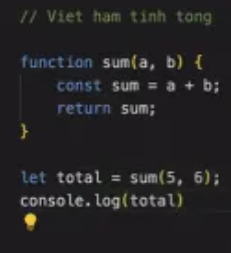

# 1. Git

### 1.1. Cách thay đổi commit message:

Git log: xem lịch sử commit

Chỉ có thể thay đổi commit message gần nhất

- C1: git commit - - amend: mở ra màn hội thoại revision ⇒ chưa chỉnh sửa đc ⇒ viết i trên bàn phím để chỉnh sửa ⇒ Thay đổi commit message ⇒ Gõ esc ⇒ :wq ⇒ nhập git log để kiểm tra lại

- C2: git commit —amend -m”feat: mess muốn thay” ⇒ git log để kiểm tra lại

### 1.2. Đưa từ vùng staging về working directory: git restore - -staged .

### 1.3. Đưa từ repo về working directory: git reset HEAD~1

Chạy lệnh git reset HEAD~1 ⇒ là cho về commit gần nhất ⇒ commit 3 về working directory 

VD: git reset HEAD~2 ⇒ commit 3, commit 2 về working directory 

* Lấy path để add : 

- Undo là gì ?

Đây là undo 3 commit gần nhất về working directory: git reset HEAD~3 

### 1.4. Branching model

- Tạo nhánh để tạo ra vùng làm việc mới ⇒ lead review, test đúng ⇒ merge vào nhánh main

- Từ 2 người trở lên check out ra nhánh của mình:

- C1:
    - tạo nhánh mới: git branch <tên nhánh> (tạo bản sao từ main sang nhánh mới)
    - từ nhánh main sang nhánh mới tạo: git checkout <tên nhánh>

- C2: Gộp 2 lệnh trên : git checkout -b <tên nhánh>

- Để biết ở nhánh nào dùng lệnh: git branch 

- Nhánh nào màu xanh là nhánh đang đứng

### * Bổ sung
- Checkout về 1 revision (commit hash) bất kì: nhằm xem thời điểm quá khứ code của mình như nào

    VD:  Chạy git log 
    
    => commit 5a73b9e6c53ed20aafdbecfd0c792b957805367c (HEAD -> main, origin/main)

    => thì revision (commit hash) là: 5a73b9e6c53ed20aafdbecfd0c792b957805367c 

    => câu lệnh checkout: git checkout 5a73b9e6c53ed20aafdbecfd0c792b957805367c 

### 1.5. Gitignore

- Nếu bỏ path vào file gitignore thì file đó k đc quản lý bởi git nữa

- nếu folder thì thêm / ở cuối

??? file ở vùng repo và staging có dc đưa vào ignore k nhỉ ???

ở staging thì vẫn ignore đc, còn ở repo thì k ignore đc nữa

- Xem nhánh, chuyển nhánh:  incoming/ outgoing: list commit mình đã làm

# 2. Javascript
- Thêm conventions:

    - `tên file: aaa-bbb-ccc`
    - `tên biến: từ đầu viết thường các từ sau viết hoa`
    - `tên class: Viết hoa từ đầu`

- Có 3 cách in:
    - Nháy đôi: console.log(”K14”);
    - Nháy đơn: console.log(’K14’);
    - Nháp chéo ( ` ): console.log(`K14`);    - - có thể chuyền biến vào

- Cộng: thì viết liền
- Phẩy: thì viết cách

- Kiểu dữ liệu: Object
    
    
    

- **Cách update:** update giá trị của object khi khai báo const thì ĐƯỢC , còn thay đổi biến hay thêm biến thì KHÔNG ĐƯỢC.
    
    vd: update tuổi
    
    - C1: [student.name](http://student.name) = 25
        
        
        
    - C2: student[”nameStudent”] = “Quang Pham”
        
        
        
        Lưu ý: thường sd ngoặc vuông vì vd biên có khoảng cách thì dùng . không đc
        

- **UPDATE thuộc tính nằm trong thuộc tính con:**

- **Thêm thuộc tính vào Object:** dùng dấu . hoặc ngoặc vuông [] để định nghĩa thuộc tính mới. 
    VD:
    let bike = {
        make: 'Yamaha',
        model: 'YZF-R3'
    };
    bike.color = “Blue”;        //C1: .
    bike[“price new”] = 100;    // C2: []

- **Xóa thuộc tính khỏi Object:** dùng hàm delete
    VD:
    let employee = {
        name: 'Le Van C',
        age: 30,
        department: 'HR'
    };
    delete employee.age;

- **Toán tử logic (logical operator):**
    - && (và): cả 2 vế của mệnh đề đều đúng
    - || (hoặc): một trong 2 vế đúng

    

    - ! ( đảo ngược lại giá trị của mệnh đề): vd true ⇒ thì thành false

    

- Mảng (array)
    - Khai báo: const studentArr =[Nhi, Nhung, Nga];
    - In ra: console.log(studentArr);
    - Truy xuất mảng:
        - Độ dài mảng: const count = studentArr.length;
        - Số thứ tự mảng đánh số từ 0 ⇒ In giá trị đầu tiên của mảng: console.log(studentArr[0]);
    - Mảng có thể chứa nhiều kiểu dữ liệu khác nhau:
        
        
    - **Hàm push**: Để thêm phần tử vào mảng, ta dùng hàm push
        

- Function: hàm, là đoạn code đc đặt tên, tái sd
    - Khai báo:
        
        function hello() {
            console.log(”hello word!”);
        }
        
        hello();
        
        vd: 
        
        
        
    - Return value:
        
        vd: phải chạy return vì nếu k chạy return khi chạy xong nó sẽ k trả ra giá trị gì ???
        
        
        
- Vòng lặp mảng bắt đầu từ 0 nhé:

- Nếu muốn thay mặc định của phần copy path: Vào setting > gõ keyword "path separator" > thay như ảnh dưới
 
    VD:
    const arr = [1,2];
    arr.push(3);
    console.log(arr);
    
    // Kết quả in ra
    [1, 2, 3]